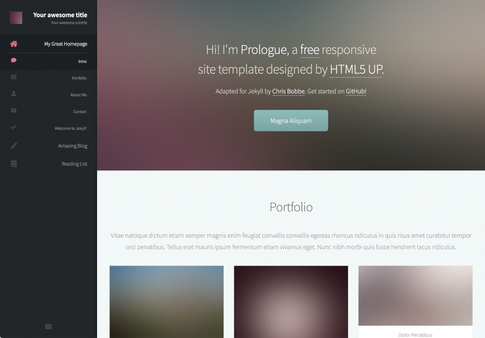

# Prologue - Jekyll Theme

[](https://badge.fury.io/rb/jekyll-theme-prologue)

This is a modified version of the [Prologue theme for Jekyll](https://jekyll-themes.com/prologue/), as used by our [company website](https://www.jaml.co.uk).

The following changes have been made:

* The `home` layout has been generalised into `sections`, which allows any page to display multiple sections from a directory
* The navigation bar has been rearranged to move the section links underneath the page link, to keep all the page navigation together
* A `sectionslike` layout has been added, for creating pages with a consistent theme but without the multiple sections

The "Installation", "Build Your Homepage" and "Add a Page" sections below have been updated with instructions for using these changes, but otherwise this README is unchanged from the version in the original repo.



# ⚠️ Unmaintained ⚠️

This is Prologue, a simple, single page responsive site template from [HTML5 UP](https://html5up.net/prologue), now available as a blog-aware Jekyll theme from [Chris Bobbe](https://chrisbobbe.github.io). It features a clean, minimalistic design and a sticky sidebar with navigation-linked scrolling.

**Demo**: https://chrisbobbe.github.io/jekyll-theme-prologue/

# Added Features

* **Blogging and multi-page features you expect from Jekyll**
* Compatible with GitHub Pages
* **[Formspree.io](https://formspree.io/) contact form integration** - just add your email to the `_config.yml` and it works!
* Build your homepage with **custom scrolly sections** in the _sections folder
 * Set a **cover photo** for any section (not just the first), with alt text for screen readers and SEO
* Add your **social profiles** easily in `_config.yml`.
* Automatic search engine optimization (SEO) **meta tags** based on info you provide in `_config.yml` and frontmatter
* **Google Analytics** built-in; just put your [Tracking ID](https://support.google.com/analytics/answer/1008080?hl=en) in `_config.yml` as `google_analytics`
* Custom **404 page** (called 404.html; to activate, move it to your project directory).

# Installation

See the README in the [original repo](https://github.com/chrisbobbe/jekyll-theme-prologue) for instruction on how to install that. They probably work for this repo, too, although I've changed the contents of the `Gemfile` to allow you to just `bundle install` from the root directory. If you know what you're doing you can probably get it to work. I don't know what I'm doing.

Next, make sure that `url` and `base_url` are set for your own website in `_config.yml`. For local testing, make them both blank. Add a photo avatar to your project, then set `avatar: path/to/your/avatar.jpg` in _config.yml; for example, `avatar: assets/images/avatar.jpg` (48x48 pixels works best). Poke around the sample `_config.yml` file to see how you can add your social profiles.

# Build your homepage

These instructions apply to any page for which you want the 'sections' behaviour, not just the homepage (`index.html`).

1. **Your `_config.yml` file must include the following lines or your homepage won't work**: 

```
collections:
	<directory1>:
	<directory2>:
```

This tells Jekyll to look in the `\_<directory1>` and `\_<directory2>` folders (which you will create) for your content and render it all on one page. Of course, replace `<directory_>` with the name of the folders you're using. You can have as many or as few of them as you like. In the example included, the `_home` folder contains the sections rendered under `index.html` and the `_list` folder contains the sections rendered under `reading-list.html`.

**Note:** If you change these values (or anything else in the `_config.yml` for that matter) you will need to re-start the Jekyll server to see the changes.

2. **Create a `_directory1` folder** (or whatever you choose to call them) in your project's root directory and start adding content to your homepage. Folders can have any name as long as it doesn't clash with an existing Jekyll folder (`_layouts`, `_includes`, `_site` and so on).

3. Update the [frontmatter](https://jekyllrb.com/docs/frontmatter/) to tell Jekyll to use the 'sections' layout and the name of the folder containing content for that page. For example, the `index.md` included in this repo contains the following to tell Jekyll to render the contents of the `_home` folder:

```
---
layout: sections
section: home
---
```

4. Set a cover photo in any of the sections by adding `cover-photo: path/to/photo.jpg` and `cover-photo-alt: your alt text here` to the section's frontmatter. Sample content is provided in the [GitHub repository](https://github.com/chrisbobbe/jekyll-theme-prologue/tree/master/_sections).

All new sections should be added as html or Markdown documents in the `_sections` folder. The following section variables can be set with [frontmatter](https://jekyllrb.com/docs/frontmatter/):
- `title` (required)
- `order` (required; orders the sequence of sections on the page. Example: `1`)
- `cover-photo` (optional; sets a background image for the section. Example: `assets/images/banner.jpg`)
- `cover-photo-alt` (required if using a cover photo. Describes the photo for screen readers and SEO; e.g. "Dome of Light art installation, Kaohsiung, Taiwan")
- `icon` (optional; see [Font Awesome](https://fontawesome.com/icons) for icon codes. Example: `fa-github`)
- `icon-style` (optional; "solid" is default, "regular" for outline style icons, or "brands" for logos)
- `auto-header` (optional; "use-title" is default, "none" for no header, or custom header text)
- `hide` (optional; if `true`, the section won't appear)

# Start blogging!

Jekyll has great resources to get you started writing blog posts. Check out [this Jekyll Docs page](https://jekyllrb.com/docs/posts/) first. When you've written a post or two, copy the following into a new file in your project directory called `blog.html`, and you'll see a link to your blog from the homepage:

```
---
layout: blog
title: My Blog
---
```

-- and that's it!

# Add a page

To add a page, just make a new .html or .md file in your project directory. There's an example called `reading-list` [provided](https://github.com/chrisbobbe/jekyll-theme-prologue/blob/master/reading-list.md) with the GitHub repository. Add this frontmatter:

```
---
title: My New Page
layout: page
---
```

If you would like your page to include the same centred layout as the `sections` pages, but without the need for the sections folder or the additional entries in the nav bar, you can use the `sectionlike` layout.

You can also set these page variables in the frontmatter, if you want:
- `subtitle`
- `order` (orders links in the nav menu, e.g. `1`)
- `icon` (optional; see [Font Awesome](https://fontawesome.com/icons) for icon codes. Example: `fa-github`)
- `icon-style` (optional; "solid" is default, "regular" for outline style icons, or "brands" for logos)
- `hide` (optional; if `true`, a link won't appear in the nav menu. All this does is remove the nav link; your page will still be served to anyone who has the URL.)

**This same set of frontmatter variables (including `title`) can also be set in `index.md` and `blog.html`.** You may want to give them titles, or hide the homepage link with `hide: true` if the homepage is the only page.

For advanced SEO, this theme also lets you add `permalink` (see [Jekyll Docs](https://jekyllrb.com/docs/permalinks/#where-to-configure-permalinks)), `robots` (string, e.g. "noindex, nofollow"), and `canonical` (boolean; true is default) to any page or post.

# Contributing

Please feel free to submit issues and feature requests!

# Credits

Thanks to @andrewbanchich for his many Jekyll adaptations of HTML5 UP's elegant themes, which helped and inspired me, and of course many thanks to HTML5 UP.

Original README from HTML5 UP:

```
Prologue by HTML5 UP
html5up.net | @ajlkn
Free for personal and commercial use under the CCA 3.0 license (html5up.net/license)


This is Prologue, a simple, single page responsive site template. It features a
clean, minimalistic design and a sticky sidebar with navigation-linked scrolling.

Demo content images* are courtesy of the ridiculously talented Felicia Simion. Check out
more of her amazing work over at deviantART:

http://ineedchemicalx.deviantart.com/

(* = Not included! Only meant for use with my own on-site demo, so please do NOT download
and/or use any of Felicia's work without her explicit permission!)

Demo banner images* courtesy of Unsplash, a radtastic collection of CC0 (public domain)
images you can use for pretty much whatever.

(* = Not included)

AJ
aj@lkn.io | @ajlkn

PS: Not sure how to get that contact form working? Give formspree.io a try (it's awesome).


Credits:

	Demo Images:
		Felicia Simion (ineedchemicalx.deviantart.com)
		Unsplash (unsplash.com)

	Icons:
		Font Awesome (fortawesome.github.com/Font-Awesome)

	Other
		jQuery (jquery.com)
		html5shiv.js (@afarkas @jdalton @jon_neal @rem)
		CSS3 Pie (css3pie.com)
		background-size polyfill (github.com/louisremi)
		Respond.js (j.mp/respondjs)
		jquery.scrolly (@ajlkn)
		jquery.scrollzer (@ajlkn)
		Skel (skel.io)
```
